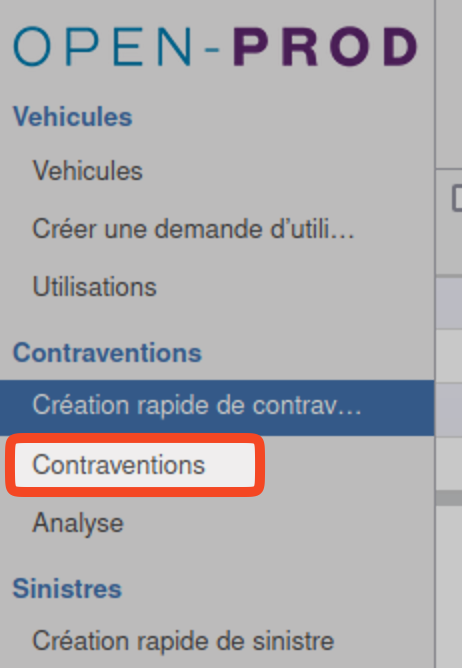

  

# Documentation utilisateur module Gestionnaire de flotte automobile

## **Version du document**

| **Version** | **Auteur** | **Date** | **Motif** |
| --- | --- | --- | --- |
| **1** | Jérôme Botreau | 20/05/2024 | Création |

## **Généralités**

Ce module permet de suivre une flotte automobile : véhicules, contrats associés, PV, sinistres, coûts,...

## **Prérequis**

Se rendre sur la page du module via le menu principal > Flotte automobile

## **Configuration initiale**

### **Droits**

Rendez-vous dans la configuration d'Open-prod > Utilisateurs et sécurité > Utilisateurs. Affectez les droits selon les utilisateurs souhaités.
Niveaux de droits standards :

- Utilisateur : Permet l'utilisation générale, la consultation des éléments.
- Fonctionnel : En plus du profil utilisateur, la modification des éléments.
- Responsable : En plus du profil utilisateur, permet la création des fiches : véhicules, contrats, interventions,...
- Administrateur : En plus du profil responsable, permet d'accéder à la configuration du modules : modèles, fabricants,...

Il existe également un droit spécifique pour les demandes de réservations de véhicules : Droits supplémentaires > Peut réserver un véhicule

### **Fabricants**

Les fabricants automobiles sont importés à l'installation du module, mais peuvent être modifiés / aEventuellementjoutés via le menu Configuration > Fabricants automobiles (Niveau droit admin du module requis)

### **Modèles**

Dans le cas où vous utilisez plusieurs véhicules du même modèle, il est intéressant de créer un modèle. De cette manière, lorsque vous devrez créer un nouveau véhicule, la sélection propagera la plupart des champs, renseignés dans le modèle.
Pour se rendre sur les modèles :  Flotte automobile > Configuration > Modèles

Renseigner les informations liées au modèle de véhicule.

### **Conducteurs**

Rendez-vous dans le menu Flotte automobile > Configuration > Conducteurs afin de les paramétrer : 

Cocher le champ 'Est utilisateur' si le compte associé existe déjà sur Open-prod. Sinon, laisser décoché et saisir son nom / prénom.
Vous pouvez également saisir la date de permis et lier un scan du permis de conduire.

### Véhicules

Accéder aux véhicules via le menu Flotte automobile > Véhicules : 

#### Création

Pour ajouter un véhicule, cliquer sur le bouton "Créer".

Commencer par renseigner :

- Le fabricant (obligatoire)
- Le modèle (facultatif) : recommandé : permet de propager les informations pré-définies du modèle dans le véhicule
- Le reste des informations : immatriculation, date, statut,...
- Éventuellement les documents liés

#### Vues

4 types de vues existent :

- Arbre (liste)
- Formulaire
- Kanban (cartes)
- Map (carte) (Nécessite une API d'interconnexion)

### Contrats

Pour ajouter un contrat (assurance, bail, leasing,...), sur la fiche du véhicule (en modification), se rendre sur l'onglet 'Contrats', puis cliquez sur 'Ajouter un élément' : 

Renseigner les différents éléments, puis sauvegarder. Le contrat est lié au véhicule :

#### Détail des champs du contrat :

- Statut : le contrat peut être au statut Brouillon / En attente / En cours / Expiré.
 
- Groupe 'Infos' :

Renseigner toutes les infos générales du contrat : référence, partenaire, responsable interne,...

- Groupe 'Dates' :
    - Le champ 'Reconduction tacite' est purement indicatif.
    - Le champ 'rappel' permet de définir une date et un destinataire de rappel, qui sera notifié via une action. (ex: rappel de résiliation)

- Onglet 'Coûts' :

    - Coût initial : permet de définir le coût liée à la mise en place du contrat (frais d'application)
    - Coûts périodiques : vous pouvez entrer des coûts périodiques ainsi que la fréquence (ex: Loyer). Cela aura pour effet d'alimenter les statistiques du coût total du contrat. L'ajout de ces coûts périodiques est géré par un Cron (tâche planifiée)
    - Coûts générés par les factures : Vous pouvez lier des factures au contrat, vous retrouverez les coûts associés ici.

    Pour ajouter le lien avec des factures : Cliquez sur le bouton d'action "Lier facture(s)" : 

    

    S&électionner la (les) facture(s) (par défaut, les montans sont filtrés par rapport au montant attendu, dans l'exemple : 166€), puis validez :

    

    Le champ calculé coût liés aux factures est mis à jour : 

    

- Onglet 'Factures' :
Vous retrouvez les factures précédemment liés.

- Onglet 'Documents' :
Vous pouvez renseigner ici tout type de document issu de la GED Open-prod (contrat scanné,...)

- Onglet 'Notes' :
Vous pouvez renseigner les notes internes liées au contrat.

#### Liste des contrats :

### Interventions

Depuis la fiche du véhicule, vous pouvez créer directement une intervention : 

Sauvegarder, puis l'intervention est liée au véhicule : 

#### Détail des champs de l'intervention :

- Statut : l'intervention peut être au statut Demandée / planifiée / En cours / Terminée.

- Groupe 'Infos' : Renseigner le fournisseur, montant (estimé ou réel), kilométrage une fois l'intervention terminée. Note : renseigenr le kilométrage ici mettra à jour automatiquement le kilométrage du véhicule.

- Groupe 'Planning' : Renseigner la date planifiée, et la date réelle une fois l'intervention terminée.

- Onglet 'Documents' :
Vous pouvez renseigner ici tout type de document issu de la GED Open-prod (devis, rapport d'intervention scanné,...)

- Onglet 'Notes' :
Vous pouvez renseigner les notes internes liées à l'intervetion : remarques éventuelles du garage,...

#### Liste des interventions :

### Contraventions

Pour ajouter une contravention, utiliser l'assistant de création rapide. Une fois sauvegardée, elle est liée au véhicule.

#### Détail des champs de la contravention :

- Statut : Reçue, En attente paiement, Payée / Contestée

- Groupe origine : Spécifier le véhicule (obligaotire) et le conducteur à l'origine de la contravention.

- Groupe contravention : Spécifier la date (obligatoire), et le lieu de contravention.

- Onglet Documents : Insérez ici la contravention scannée.

- Onglet Note : Spécifier éventuellement des notes internes.

#### Liste des contraventions :

### Statistiques

Vous pouveez accéder aux statistiques sur les contraventions et inteventions depuis les menus "Analsye" : 

Il est possible de basculer entre le mode tableau croisé dynamique et vue graphique via le selecteur de type de vue.
Vous pouvez aussi modifier les dimensions et mesures, exemples de mesures : 

- Nombres de contraventions / conducteur
- Coût entretien / véhicule, ...

### Demandes d'utilisation

Les demandes d'utilisations peuvent être utiles pour les véhicules partagés ou non affiliés à un conducteur spécifique.
N'oubliez pas de donner le droit de demander une utilisation dans les paramètres utilisateurs.

Menu Flotte automobile > Véhicules > Créer une demande d'utilisation :

#### Détail des champs de la demande d'utilisation :

- Statut : Demandé, Accepté / Refusé, Terminé

- Groupe requête : Renseigner la date de la demande, le véhicule (obligatoire) et conducteur concerné (obligatoire)

- Groupe Dates : Spécifier la date de début (obligatoire), et éventuellement la date de fin.

- Groupe Notes : Notes internes.

#### Vues spécifiques

En plus de la vue arbre et formulaire, une vue planning est disponible :

